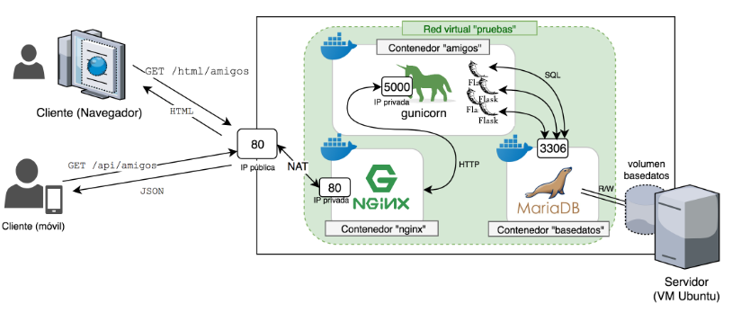
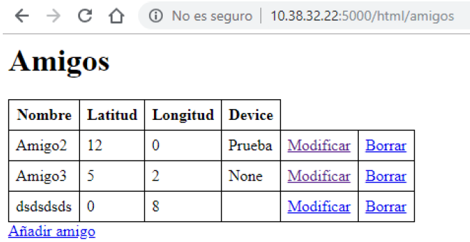
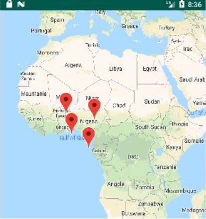

# SOCIAL APP ANDROID 

Este repositorio contiene el código para:
- Crear un servicio web que soporte una API REST (carpeta servicio_web).
- Crear una aplicación en Android que haga peticiones al servicio web (carpeta aplicacion_android).

El servicio web se trata de una lista de personas de los cuáles se tiene la información de su posición.
El servicio web está soportado por NGINX
La aplicación web alojada en el servidor se desarrolla con el framework Flask, que utiliza un servidor wsgi para conectar 
python con el servidor de aplicaciones. 
Como servidor de aplicaciones se utiliza gunicorn.
Los datos se almacenan en una base de datos MariaDB.

La API REST da soporte a las siguientes peticiones:
-GET /amigo/id
-GET /amigo/byName/name
-GET /amigos
-PUT /amigo/id
-DELETE /amigo/id
-POST /amigos

La arquitectura de despliegue es la siguiente:

La aplicación web se puede lanzar mediante los siguientes scripts, que son alojados en un servidor Ubuntu:
- lanza-basedatos.sh: lanza el contenedor con la base de datos
- lanza-flask.sh: lanza el contenedor con la aplicación 
- lanza-nginx.sh: lanza el contenedor con el servidor que aloja la aplicación 

Los contenedores son desplegados con Docker.

La aplicación una vez lanzada es accesible localmente:

Una vez creada la aplicación web se puede explotar la información proporcionada por una aplicación móvil Android, que informe de la 
localización de las personas que usen la aplicación.
En primer lugar para hacer la aplicación accesible al resto del mundo se utiliza serveo para redirigir las peticiones a su servidor a nuestro servidor que tenemos corriendo en nuestra máquina. La interfaz de la aplicación es muy sencilla: símplemente mostrará en un mapa
la localización del resto de usuarios de la aplicación: 

Para enviar información desde el servidor a la aplicación utilizaremos el servicio Firebase Cloud Messaging. Cada vez que un usuario
adquiera una nueva posición el servidor lo comunicará al resto de usuarios en el backend, pero en la aplicación símplemente se 
visualizará el cambio de posición en la chincheta.
